# J124 Final Project: An Analysis of the San Francisco and San Mateo's Employment Projection 10 years from now
## Created by Chris Ceguerra
 

### Introduction

No one knows what will happen in the following years, but experts can foresee and project hypotheses backed with research and data. For instance, the application of AI in different industries worries many creative and skilled workers over claims that it steals their job or pushes them to become obsolete. The topic of AI is timely-relevant, especially in Silicon Valley, which includes San Francisco and San Mateo Counties. Over the last two years, the popularity of AI has shaken the digital world. The tech industry is a lucrative field, and its boom in the Bay Area signaled gentrification. The tech jobs available within these cities and nearby areas entice Americans to relocate, therefore ramping up the cost of living with the demand for housing. With inflation and price hikes left and right, salaries should also stay consistent for those who work outside the tech industry to sustain their expenses. 

 This pitch aims to illustrate how the labor market in San Francisco and San Mateo Counties will look in 10 years, according to the State of California's occupational data and projections. This project aims to elucidate the direction of employment and what changes they can anticipate to better prepare for the future. This project also aims to remind people that some jobs will stay relevant and San Francisco and San Mateo can still procure decent salaries even if they don't have the time and capacity to earn a degree. 

   

### Analyses
#### Before anything else, we need to clean our data.  
1. Download the [Long-Term Occupational Employment Projections](https://catalog.data.gov/dataset/long-term-occupational-employment-projections) on the Data.gov website or click [here](/Long-Term_Occupational_Employment_Projections.csv).
2. Upload the file on your Google Drive and open it.
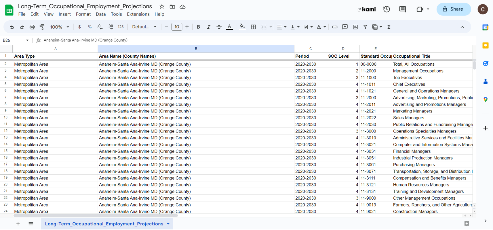
3. Right-click the sheet below and click "Duplicate".
4. Once you have a copy of the original sheet, click <strong>Row 1</strong> to highlight all titles. Click "View" above your ribbons, and find "Freeze" so that titles will stay even if you scroll. Click it, and click the "1 Row" option.
5. Next, click the corner cell adjacent to the first <strong>Row 1 </strong> and <strong>Column A</strong> to highlight every cell with values. Look for the "Filter" button, which looks like a funnel.
6. Press the funnel icon on the right of <strong>B1</strong>, which says "Area Name (County Names)". Unselect everything except "San Francisco-Redwood City-South San Francisco MD (San Francisco and San Mateo Counties)".  
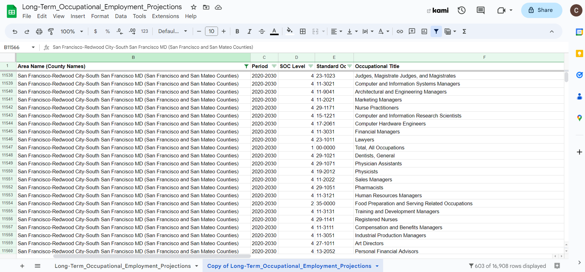 
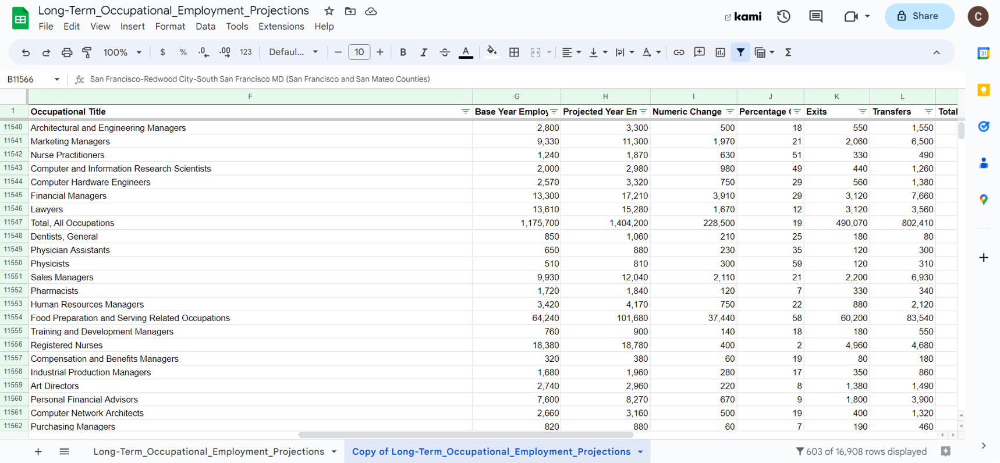  
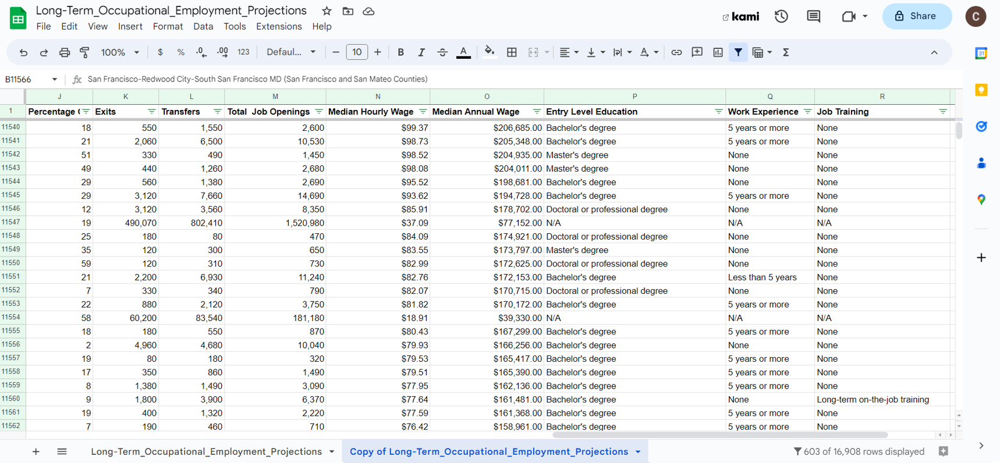  

#### You're data is ready.
 

#### A. Which occupations are projected to have the highest employment growth in 10 years? Which occupations are projected to have the most decline in 10 years?
1. Click the funnel button next to <strong>Numeric Change</strong>.
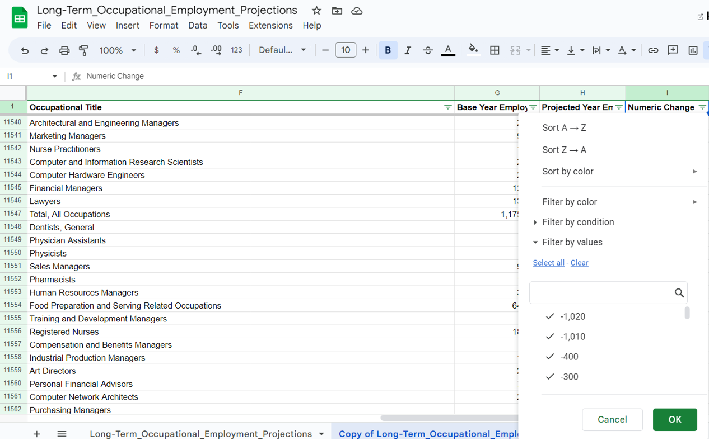 
2. Click "Sort Z --> A" to arrange in descending order to start with the occupations with the biggest growth.
3. Click "Sort A --> Z" to arrange in ascending order to start with the occupations with the largest decline.
 
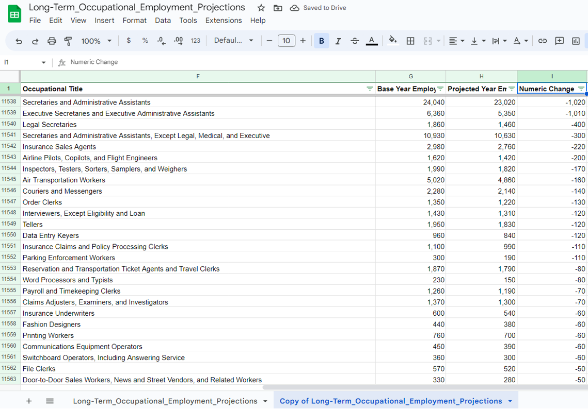 
 

#### B. Which occupations will have the highest number of openings in 10 years?
1. Click the funnel button next to <strong>Total Job Opening</strong>.
2. Click "Sort Z --> A" to arrange in descending order to start with the occupations with the largest job openings.
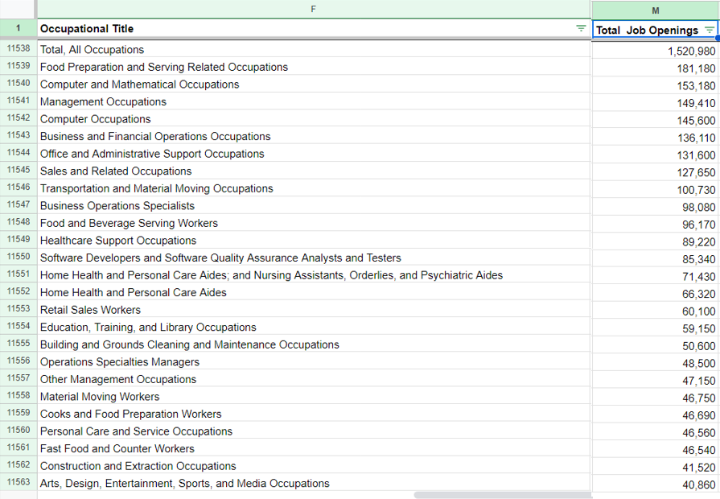
 

#### C. What are the highest-paying jobs that don’t require a college education and what is what is the number of openings?
1. Click the funnel button next to <strong>Entry Level Education</strong>.
2. Uncheck everything except “No formal education”, and “High school diploma or equivalent”.
3. Next, click the funnel button next to <strong>Median Annual Wage</strong>.
4. Click "Sort Z --> A" to arrange in descending order to start with the occupations with the highest salary that don't require a college education.
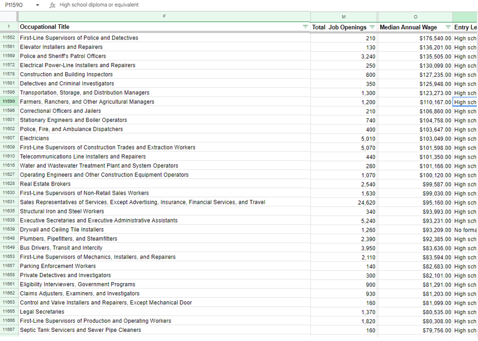
 

#### D. What is the average "median" annual salary of workers from San Francisco and San Mateo Counties based on education attainment?

1. Click the corner cell adjacent to the first <strong>Row 1 </strong> and <strong>Column A</strong> to highlight every cell with values.
2. Click "Insert" above your ribbons, and find "Pivot Table".
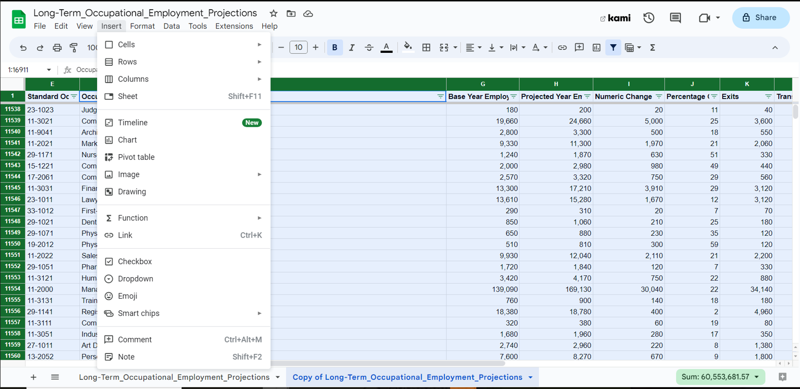 
3. Rename the new sheet if you want. Make sure the "Insert to New Sheet" is toggled. Click "Create".
4. On the right side of your screen is your "Pivot table editor".
5. Drag <strong>Entry Level Education </strong> under "Rows".
6. Drag <strong>Median Annual Wage </strong> under "Values". Make sure the values are summarized by <strong> average </strong>.
7. For the filters, you need to drag <strong> Area Name (County Names) </strong> and uncheck everything except "San Francisco-Redwood City-South San Francisco MD (San Francisco and San Mateo Counties)".
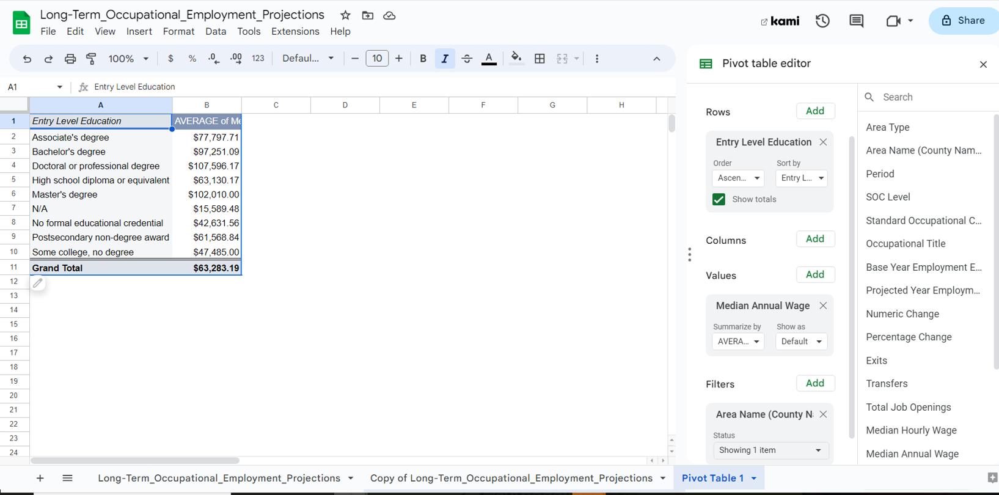
 

#### E.  Which occupation has the highest number of transfers?

1. Back to your duplicated sheet, 1. Click the funnel button next to <strong>Transfers</strong>.
2. Click "Sort Z --> A" to arrange in descending order to start with the occupations projected to have the most transfers.
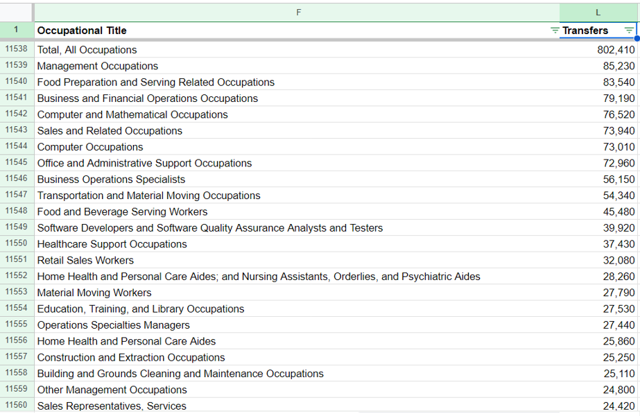
 
 

### Visualizations

 
 
 

 
